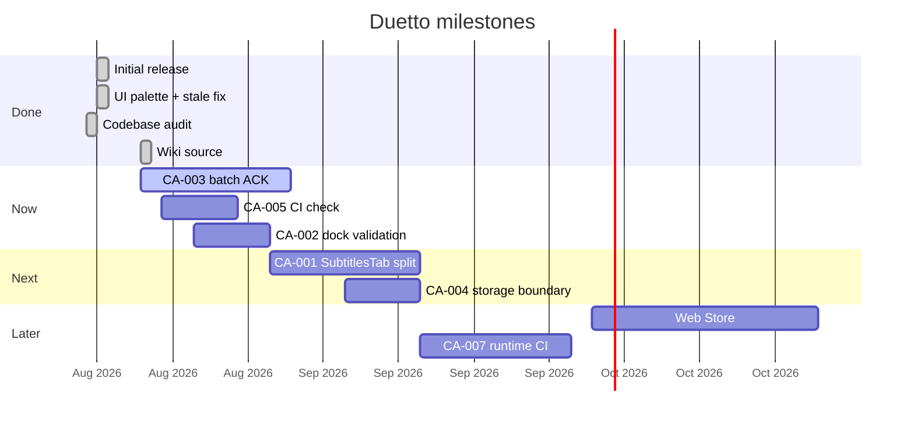

# Roadmap

Product direction for [Duetto](https://github.com/batu3384/duetto). Items come from shipped work, [README](https://github.com/batu3384/duetto#readme), and the [2026-08-15 codebase audit](https://github.com/batu3384/duetto/tree/main/docs/codebase-audit) — not speculative features.

## Status legend

| Status | Meaning |
|--------|---------|
| **Done** | Shipped on `main` |
| **Now** | Active focus / next PR |
| **Next** | Queued after Now |
| **Later** | Valid but not scheduled |

Track execution via [GitHub Issues](https://github.com/batu3384/duetto/issues). Security: [Security Advisories](https://github.com/batu3384/duetto/security/advisories).

---

## Done

| Item | Status | Notes |
|------|--------|-------|
| GitHub repo + README + MIT | Done | [eff937a](https://github.com/batu3384/duetto/commit/eff937a) |
| Duetto rebrand v2.17 (storage migration) | Done | `dualis_*` → `duetto_*` |
| Video dock UX (ambient band, opacity 0–100) | Done | v2.15–2.16 |
| Unified popup/overlay chrome palette | Done | [7c63389](https://github.com/batu3384/duetto/commit/7c63389) |
| Stale extension context handling | Done | [a5cdb6b](https://github.com/batu3384/duetto/commit/a5cdb6b) |
| Static codebase audit | Done | `docs/codebase-audit/2026-08-15-1641.md` |
| GitHub Wiki (source in `wiki/`) | Done | This page |

---

## Now

| Item | Status | Notes |
|------|--------|-------|
| CA-003 — Rest translation batch ACK | Now | SW must not block on full-lecture `sendResponse`; partial + queue ([audit](https://github.com/batu3384/duetto/blob/main/docs/codebase-audit/2026-08-15-1641.md#ca-003--major--reliability--srcbackgroundindexts)) |
| CA-005 — CI gate for `npm run check` | Now | Self-check scripts exist; no GitHub Actions workflow yet |
| CA-002 — Dock `captureStream` validation on Udemy | Now | Manual verify taint/fallback on real MSE lectures |

---

## Next

| Item | Status | Notes |
|------|--------|-------|
| CA-001 — Split `SubtitlesTab.tsx` | Next | Extract dock / font / edge subcomponents (~800+ lines) |
| CA-004 — Harden content storage boundary | Next | Content imports only `getPageSettings`; lint or wrapper |
| CA-006 — Split toolbar from `uiRenderer.ts` | Next | Reduce god-file maintenance risk |

---

## Later

| Item | Status | Notes |
|------|--------|-------|
| Chrome Web Store listing | Later | README documents dev install only today |
| CA-007 — Runtime check in CI | Later | Wire `npm run check` into optional `--runtime` audit plan |
| Dependency audit automation | Later | npm audit / lockfile policy in CI (no Cargo in this repo) |

---

## Timeline (approximate)

---

## How to propose changes

1. Open a [GitHub Issue](https://github.com/batu3384/duetto/issues/new) with problem + acceptance criteria.
2. Security-sensitive work → [Security Advisories](https://github.com/batu3384/duetto/security/advisories/new).
3. After merge, update this page via `wiki/Roadmap.md` + `./scripts/sync-wiki.sh`.
